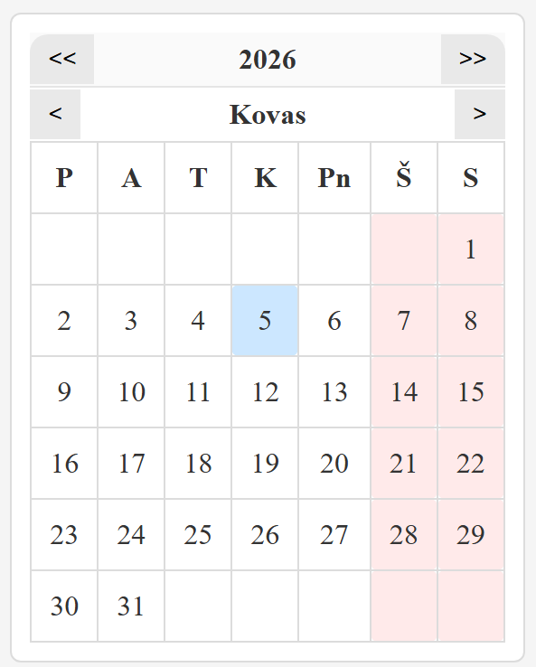

🔗 

Live demo: https://stormsinger.github.io/js-calendar/

# JavaScript kalendorius

Paprastas kalendoriaus komponentas, parašytas grynu JavaScript (be frameworkų).

## Funkcijos

- Mėnesių ir metų navigacija
- Šiandienos dienos paryškinimas
- Pasirinktos dienos paryškinimas
- Savaitgalių išskyrimas

## Paleidimas

1. Atsisiųsk projektą arba nuklonuok repo.
2. Atidaryk `index.html` naršyklėje.

## Naudotos technologijos
- JavaScript (DOM manipulation)
- HTML5
- CSS3