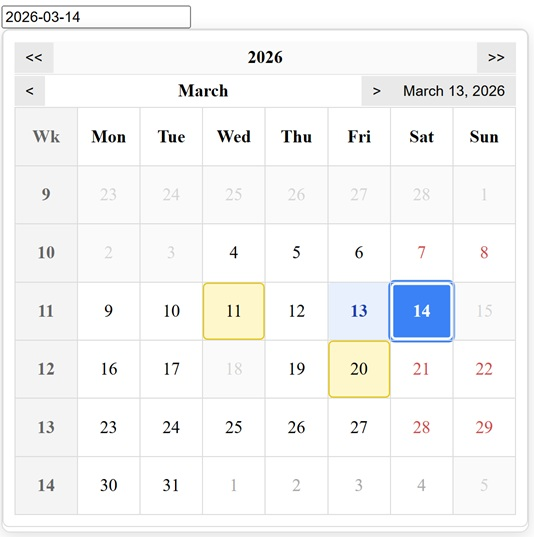

DatePicker
- Accessible, keyboard‑navigable, framework‑agnostic JavaScript DatePicker.

🔗 Live demo: https://stormsinger.github.io/js-calendar/
🔗 Repository: https://github.com/stormsinger/js-calendar

Features
- ARIA dialog + ARIA grid
- Full keyboard navigation
- Modular architecture
- Localization
- ISO Week numbers
- Min/max dates
- Disabled dates
- Highlighted dates
- No dependencies
- Dynamic positioning
- Smooth month transitions
- Clean CSS separation

Folder Structure
    /calendar
        /css
            datepicker.css
            calendar.css
            navigation.css
            animations.css
        /js
            DatePicker.js
            CalendarRenderer.js
            Navigation.js
            Positioning.js
            DateUtils.js

Installation:
Include the CSS files in your HTML:
    <link rel="stylesheet" href="css/datepicker.css">
    <link rel="stylesheet" href="css/calendar.css">
    <link rel="stylesheet" href="css/navigation.css">
    <link rel="stylesheet" href="css/animations.css">
Add the HTML structure:
    <input id="date-input" type="text" readonly>
    

        

    

Usage:
    

API Options:
    Option: inputSelector
        Type: string
        Default: required
        Description: CSS selector for the input element that triggers the DatePicker.
    Option: containerSelector
        Type: string
        Default: required
        Description: CSS selector for the container where the calendar will be rendered.
    Option: locale
        Type: string
        Default: "en-US"
        Description: Controls localization (month names, weekday names, first day of week).
    Option: firstDayOfWeek
        Type: number
        Default: 1
        Description: Sets the first day of the week (0 = Sunday, 1 = Monday).
    Option: minDate
        Type: Date or null
        Default: null
        Description: The earliest selectable date.
    Option: maxDate
        Type: Date or null
        Default: null
        Description: The latest selectable date.
    Option: disabledDates
        Type: array of Date
        Default: []
        Description: Dates that cannot be selected.
    Option: highlightedDates
        Type: array of Date
        Default: []
        Description: Dates that are visually highlighted in the calendar.
    Option: onSelect
        Type: function(date)
        Default: null
        Description: Callback function fired when the user selects a date.

Examples

Basic usage
A simple DatePicker attached to an input and container

    <input id="basic-input" type="text" readonly>

    

        

    

    

Min and max selectable dates
Restricts the calendar so the user can only choose dates within a defined range

    <input id="range-input" type="text" readonly>

    

        

    

    

Disabled dates
Specific dates cannot be selected. They appear visually disabled in the calendar

    <input id="disabled-input" type="text" readonly>

    

        

    

    

Highlighted dates
Highlights specific dates without disabling them

    <input id="highlight-input" type="text" readonly>

    

        

    

    

Locale and first day of week
Changes language and week layout.

    <input id="date-input" type="text" readonly>

    

        

    

    

Browser Support
The component works in all modern browsers:
- Chrome
- Firefox
- Safari
- Edge
No experimental APIs or polyfills are required.

Working with GitHub Copilot

There are two distinct Copilot tools, and they complement each other well:

1. GitHub Copilot in VS Code (inline assistant)
   Install the GitHub Copilot extension from the VS Code Marketplace:
   https://marketplace.visualstudio.com/items?itemName=GitHub.copilot

   Once installed you get:
   - Inline code completions as you type
   - Copilot Chat panel (Ctrl+Shift+I) for questions and refactoring
   - Inline chat (Ctrl+I) to edit a selected block of code
   - /explain, /fix, /tests slash commands in the chat

   This is your everyday coding companion. It sees your local files in real time,
   even before you commit or push anything.

2. GitHub Copilot Coding Agent (this agent, on GitHub.com)
   The coding agent is triggered from GitHub Issues or pull requests.
   It clones the repository, reads the pushed code, makes changes, and opens a PR.
   Because it runs in an isolated cloud environment it can only work with code that
   has already been pushed to GitHub.

Recommended hybrid workflow
   1. Code normally in VS Code with the Copilot extension for real-time assistance.
   2. Commit and push your work to GitHub when a feature or fix is ready.
   3. Open a GitHub Issue describing a task you want the coding agent to handle
      (e.g. "Add a clearDate button to the picker").
   4. Assign the issue to GitHub Copilot — it will open a draft PR with the changes.
   5. Review the PR in GitHub or pull it locally with:
          git fetch origin
          git checkout <branch-name>
      and continue iterating in VS Code.

In short: VS Code Copilot works on your local, unpushed code; the coding agent
works on pushed code via GitHub Issues. Using both together gives you the best of
both worlds.

License
MIT License — free to use, modify, and integrate into personal or commercial projects.
